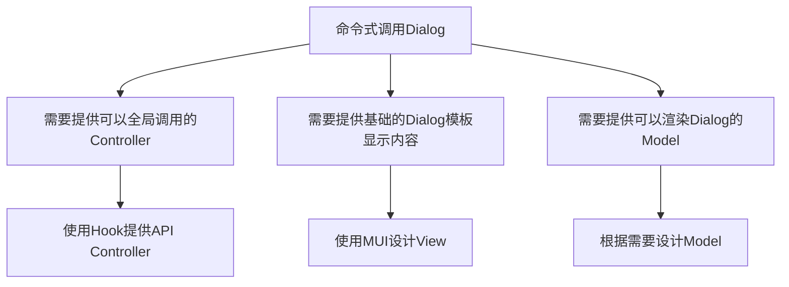

# 基于 MUI 实现的全局 Dialog

# 概述

在最近使用 MUI 的过程中，我突然发现 MUI 的 Dialog 好像没有如同 Arco Design 那样自带[命令式调用方法](https://arco.design/react/components/modal#modalmethodconfig)，这个缺失的特性导致我在使用 Dialog 时（即便我只是想很简单地显示一点提示信息），必须显式地在 UI 中声明一个 Dialog 组件。

编写重复代码的过程其实是非常痛苦的，而当重复的代码慢慢累积起来之后，核心代码的可读性也会受到一定的影响。

为了减少编写重复代码的时间，我想使用”池化“的思维来构建一个全局的临时 Dialog 组，同时提供一个可以在全局进行调用的 Hook，把展示临时 Dialog 的声明缩略到一条语句以内。

# 外部依赖

- React

- MUI

- Recoil（可选，不想用状态管理库的话，本文也提供了一种通过手写 Observable 同步全局状态的办法）

# 仓库

有人可能更喜欢从源码入手去理解逻辑，这里先把 Demo 的仓库丢出来：

[GitHub - sheason2019/global-dialog-demo](https://github.com/sheason2019/global-dialog-demo)

# 起步

为了节省时间，一些比较基础的部分我就不讲的太细了。

在开始正式编码之前，我们首先需要使用[Vite](https://cn.vitejs.dev/guide/)搭建起一个基础的 React-Typescript 框架，然后将 React、[MUI](https://mui.com/zh/material-ui/getting-started/installation/)和[Recoil](https://recoiljs.org/zh-hans/)这三个依赖库添加至项目。

方便起见，这里把除了 React 以外的安装页面链接都附在了上面的超链接文本里。

# 分析需求

在上面的概述中，我提到了我希望在使用 MUI 时能像使用 Arco Design 一样通过命令式的方式调用 Dialog，从而提升开发体验和代码结构。

根据这个核心的需要我们可以很快推导出我们需要做的事情：



可以看到，这是一个很典型的 MVC 设计，所以，我们接下来按照最常规的 MVC 开发流程来实现这个需求即可。

# Model 层的设计

在通常的 Web 程序设计中，使用 Dialog 来展示提示信息的场景多种多样，具体可以参考[Arco Design - Dialog 消息展示](https://arco.design/react/components/modal#%E6%B6%88%E6%81%AF%E6%8F%90%E7%A4%BA)，我们这里只实现两种最基本的 Dialog 场景：信息展示和操作确认。

首先让我们来思考一下一个最基本的 Dialog 需要声明哪些信息：

```ts
interface IGlobalDialog {
  // 因为采用循环渲染的方式渲染Dialog组，所以需要一个UUID来确保Dialog的Key不重复
  uuid: string;
  title: React.ReactNode;
  content: React.ReactNode;
}
```

显然，对于一个最基础的 Dialog，我们最核心的诉求是让它能展示我们需要的标题和内容。

以`IGlobalDialog`为基础类型，我们可以很容易地扩展出信息展示 Dialog 和操作确认 Dialog 的接口：

```ts
// 信息展示Dialog
interface IGlobalNormalDialog extends IGlobalDialog {
  type: "normal";
}
// 操作确认Dialog
interface IGlobalConfirmDialog extends IGlobalDialog {
  type: "confirm";
}
```

然后，我们可以将这两个接口组合起来：

```ts
type GlobalDialogTypeCompose =
  | IGlobalConfirmDialogState
  | IGlobalNormalDialogState;
```

现在，我们就得到了一个可以用来表示所有可用 Dialog 接口的接口：`GlobalDialogTypeCompose`。

通过这个接口，我们可以基于 Recoil 创建出一个全局状态用来管理这些 Dialog：

```ts
const globalAlertDialogState = atom<GlobalDialogTypeCompose[]>({
  key: "common/global-alert-dialog",
  default: [],
});
```

到了这一步，Model 层的建设其实就已经完成的差不多了，在 React 组件内部编写相应的循环渲染逻辑后，我们就可以根据`globalAlertDialogState`中存储的数据启动和关闭自己需要的 Dialog。

**但是！事情并没有这么简单。** 在关闭 Dialog 时，如果你的操作只是简单地从`globalAlertDialogState`中移除掉对应的结构体，你会发现：Dialog 虽然能随着结构体的移除而被关闭，但跟正常显式声明的 Dialog 相比，它的关闭动画却很奇怪地消失了。

这是因为通过移除`globalAlertDialogState`中存储的数据来关闭 Dialog 的做法，没有正常走 MUI 为 Dialog 实现的关闭逻辑，而是直接从网页中移除了整个 Dialog 的 DOM。

为了解决这个问题，我们需要对 Dialog 的基类 Model 做一些改造：

```ts
interface IGlobalDialog {
  // 作为循环渲染的Key使用
  uuid: string;
  title: React.ReactNode;
  content: React.ReactNode;
  // Dialog开闭标识符
  open: boolean;
  // 预留字段
  extra: any;
}
```

这样一来，我们就可以通过`open`字段来控制 Dialog 是否展示，因为全局 Dialog 的使用场景总是一次性的，所以我们只需要定期去清理`open`属性为`false`的结构体，就可以完成对资源的回收，资源回收的这部分逻辑会在 View 层中提到。

值得注意的是，我在更新的`IGlobalDialog`中还新增了一个`extra`字段，这个字段的主要功能是为特殊用途的 Dialog 提供额外的接口，比如在这个 Demo 项目里，我希望用`async/await`的方式来获取用户在 confirm Dialog 里选择的结果，为了实现这个功能，我会在 Controller 部分里，创建一个 Promise 作为调用 confirm Dialog 的返回值，同时把这个 Promise 的 resolve 方法作为参数传入 confirm Dialog，这样就可以实现一个简单的异步调用。

所以，我这里还需要把`IGlobalConfirmDialogState`的接口修改为：

```ts
interface IGlobalConfirmDialogState extends IGlobalDialog {
  type: "confirm";
  extra: {
    resolver: (v: boolean) => void;
  };
}
```

到这一步就万事俱备了，接下来开始编写 View 层的代码。

# View 层的设计

因为在 Model 层中做了相当的工作来声明各种类型，View 层的代码编写起来会相对轻松一点。

首先，我们需要编写两个 Dialog 的模板代码：

```tsx
// confirm Dialog
import {
  Button,
  Dialog,
  DialogActions,
  DialogContent,
  DialogTitle,
} from "@mui/material";
import { FC } from "react";
import { DialogStateToProps, IGlobalConfirmDialogState } from "./typings";

// ConfirmDialog组件
const ConfirmDialog: FC<DialogStateToProps<IGlobalConfirmDialogState>> = ({
  open,
  title,
  content,
  extra,
  onClose,
}) => {
  const { resolver } = extra;
  const handleResove = (value: boolean) => {
    onClose();
    resolver(value);
  };
  return (
    <Dialog open={open} onClose={onClose}>
      <DialogTitle>{title}</DialogTitle>
      <DialogContent dividers>{content}</DialogContent>
      <DialogActions>
        <Button onClick={() => handleResove(false)}>取消</Button>
        <Button onClick={() => handleResove(true)}>确定</Button>
      </DialogActions>
    </Dialog>
  );
};

export default ConfirmDialog;
```

```tsx
// normal Dialog
import { FC } from "react";
import {
  Dialog,
  DialogTitle,
  DialogContent,
  DialogActions,
  Button,
} from "@mui/material";
import { DialogStateToProps, IGlobalNormalDialogState } from "./typings";

const NormalDialog: FC<DialogStateToProps<IGlobalNormalDialogState>> = ({
  open,
  onClose,
  title,
  content,
}) => {
  return (
    <Dialog open={open} onClose={onClose}>
      <DialogTitle>{title}</DialogTitle>
      <DialogContent dividers>{content}</DialogContent>
      <DialogActions>
        <Button onClick={onClose}>确定</Button>
      </DialogActions>
    </Dialog>
  );
};

export default NormalDialog;
```

细心的朋友可能注意到这里导入了一个 Model 层里没有声明过的`DialogStateToProps`接口，这个接口是干什么用的呢？

大家知道在程序设计里，纯粹的数据结构 Model 层跟用来展示视图的 ViewModel 层经常会有些出入，比如在这个 Demo 里，Dialog 的组件内部渲染实际上是用不到`IGlobalDialog`里声明的`uuid`和`type`的，而这个组件在请求关闭时会触发的`onClose`函数，在 Model 层中其实也不存在。

所以这个`DialogStateToProps`接口的主要功能就是把`Model`层声明的数据类型给转化成`ViewModel`层需要的样子，由于它更偏向于`ViewModel`层的内容，我就没有在`Model`层的部分提到这个接口。

具体内容如下：

```ts
export type DialogStateToProps<T extends IGlobalDialog> = Omit<
  T,
  "uuid" | "type"
> & {
  onClose: () => void;
};
```

可以看到，它引用了一个继承自`IGlobalDialog`的泛型，并使用工具接口 Omit 去除了泛型中的`uuid`和`type`字段，追加了一个`onClose`字段。

现在建立一个 Map，把编写好的 Dialog 跟 Model 中的 type 字段一一联系起来：

```ts
const DIALOG_MAP = {
  confirm: ConfirmDialog,
  normal: NormalDialog,
} as const;
```

然后，我们就可以开始编写全局 Dialog 的渲染工厂了：

```tsx
export const GlobalDialogRoot = () => {
  // 需要渲染的Dialogs
  const [dialogs, setDialogs] = useRecoilState(globalAlertDialogState);

  const handleRemoveDialog = (dialog: GlobalDialogTypeCompose) => {
    // 首先关闭Dialog，避免影响到Dialog关闭时的动画
    const nextDialog = { ...dialog, open: false };
    setDialogs((dialogs) =>
      dialogs.map((item) => (item === dialog ? nextDialog : item))
    );
    // 使用回调方式移除已被标记的Object
    const timer = setTimeout(() => {
      setDialogs((dialogs) => dialogs.filter((item) => item !== dialog));
    }, 1000);
    // Effect return，避免出现空setState警告
    return () => clearTimeout(timer);
  };

  return (
    <>
      {dialogs.map((dialog) => {
        const Render = DIALOG_MAP[dialog.type];

        return (
          <Render
            key={dialog.uuid}
            onClose={() => handleRemoveDialog(dialog)}
            {...dialog}
          />
        );
      })}
    </>
  );
};
```

可以看到，我们引用在 Model 层中编写好的 atom：`globalAlertDialogState`为组件引入了一个全局的数据源，并在组件的返回值中通过循环渲染语句将所需的参数赋给了对应的 Dialog 组件，完成了对 Dialog 的渲染。

同时，在这个组件里还声明了一段用来关闭 Dialog 的函数，它的逻辑也非常简单，就是先将赋给指定 Dialog 的`open`字段置为`false`，在延时一秒后再使用 filter 彻底移除被关闭的 Dialog 对象。

注意这里必须使用回调的方式来对 RecoilState 进行操作，这是因为这里的逻辑是异步的，如果使用对象作为 setState 的参数，用户在快速连续关闭多个 Dialog 的时候，可能会出现异步 setState 的值把同步 setState 的值覆盖住的情况。

到这里，View 层的内容就算编写完毕了，接下来让我们声明一个 React hook 作为 Controller。

# Controller 层的设计

Controller 层的设计就没什么技术含量了，唯一需要考量的就是该暴露给用户那些接口，然后怎么把从这些接口里接受到的数据转换为展示 Dialog 所需的 Model，并把它们写进全局数据源里。

具体内容如下：

```ts
// 注入UUID作为每个Dialog的标识符
const fillGlobalDialog = (
  props: Omit<IGlobalDialog, "uuid" | "open" | "extra">
): IGlobalDialog => ({
  ...props,
  extra: {},
  open: true,
  uuid: crypto.randomUUID(),
});
// 注入ConfirmProps所需的内容
const fillConfirmProps = (
  props: IGlobalDialog,
  resolver: (val: boolean) => void
): IGlobalConfirmDialogState => ({
  ...props,
  type: "confirm",
  extra: {
    resolver,
  },
});
// 注入NormalProps所需的内容
const fillNormalProps = (props: IGlobalDialog): IGlobalNormalDialogState => ({
  ...props,
  type: "normal",
});

// 提供react hook调用全局Dialog接口
const useGlobalDialog = () => {
  const [_dialogs, setDialogs] = useRecoilState(globalAlertDialogState);
  const Controller = {
    confirm: (val: Omit<IGlobalDialog, "uuid" | "open" | "extra">) => {
      let resolver = null;
      const asyncResult = new Promise<boolean>((res) => {
        resolver = res;
      });
      if (resolver === null) {
        throw new Error("获取resolver失败");
      }
      const dialog = fillConfirmProps(fillGlobalDialog(val), resolver);
      setDialogs((dialogs) => [...dialogs, dialog]);

      return asyncResult;
    },
    normal: (val: Omit<IGlobalDialog, "uuid" | "open" | "extra">) => {
      const dialog = fillNormalProps(fillGlobalDialog(val));
      setDialogs((dialogs) => [...dialogs, dialog]);
    },
  };
  return Controller;
};
```

Controller 层的主体就是这个`useGlobalDialog`，内容不多，可以看到它实际上就是返回了一个对象，对象里有两个函数`confirm`和`normal`，分别代表了两种不同的 Dialog。

它们的参数是一致的，使用 Omit 工具类型去除了`IGlobalDialog`中的`uuid`、`open`和`extra`字段，也就是说，用户实际上需要填入的参数只有`title`和`content`，这里其实也可以直接声明一个包含`title`和`content`的接口作为 val 的类型，但我觉得这样写可以更清晰地表示出 val 跟`IGlobalDialog`之间的“摘要”关系，最终还是写成了这个样子。

唯一值得一提的可能就是`confirm`函数中对 Promise 的用法了，从源码就能直接看到这里其实是吧一个 Promise 中的 resolver 提取了出来，当成参数丢给 confirm Dialog 去用了，这样做的好处是用户在调用`Controller.confirm`方法的时候可以用`async/await`的方式来处理从 confirm 框体中得到的结果，不好的地方在于破坏了不可变编程的代码风格，就显得这个`resolver`变量很突兀吧。

而上面的两个`fill*`函数，只看类型定义也很容易理解，就是把用户输入的内容包装成可以渲染的 Model 的函数，这倒没有什么特别值得注意的。

# 享用编码的成果

在完成以上的工作之后，这个全局 Dialog 组件就算是完工了。

接下来，我们就能编码使用这个小车轮了，一个简单的用例如下所示：

```tsx
import "./App.css";
import { Box, Button, Stack } from "@mui/material";
import useGlobalDialog, { GlobalDialogRoot } from "./global-alert-dialog";

function App() {
  const GlobalDialog = useGlobalDialog();

  const handleOpenConfirmDialog = async () => {
    const res = await GlobalDialog.confirm({
      title: "ConfirmDialogTitle",
      content,
    });
    console.log(res);
  };
  const handleOpenNormalDialog = () => {
    GlobalDialog.normal({ title: "NormalDialogTitle", content });
  };

  const content = (
    <Box sx={{ textAlign: "center" }}>
      <Stack spacing={1}>
        <Button variant="contained" onClick={handleOpenConfirmDialog}>
          OPEN CONFIRM DIALOG
        </Button>
        <Button variant="contained" onClick={handleOpenNormalDialog}>
          OPEN NORMAL DIALOG
        </Button>
      </Stack>
    </Box>
  );

  return (
    <>
      <GlobalDialogRoot />
      {content}
    </>
  );
}

export default App;
```

在一个全局的位置插入`GlobalDialogRoot`组件后，就可以在项目的任意组件里通过引入`useGlobalDialog`这个 React Hook 的形式来随时呼出一个临时的 Dialog，有时项目可能面临一些嵌套展示 Dialog 的场景，这个全局 Dialog 的逻辑其实也能很好地把它给兜住。

而在`handleOpenConfirmDialog`函数中，可以看到程序使用`await`接受了异步的返回值，并将它打印了出来。

这样，一个基本的全局 Dialog 工具就差不多实现完毕了。

# 不使用状态管理库

在某些场景下，你可能并不想为项目引入一个状态管理库，所以我在这里也提供了一种使用 Observable 设计模式来同步组件间通信的方法。

## 代码链接

同样的，这里先把源码的链接抛出来，免得我太啰嗦影响大家心情……

https://github.com/sheason2019/global-dialog-demo/tree/without-recoil

## Observable 对象

在不影响用户态的前提条件下，想实现这个全局调用 Dialog 的功能，最大的难点就在于如何实现组件间的通信，如何在其他的组件里修改`GlobalDialogRoot`中的状态。

一看到这个核心问题，那第一反应肯定就是使用 Observable 设计模式来构建组件间通信，找到方向后，我们很快就可以编写出这样一个基础的 Observable：

```ts
import { GlobalDialogTypeCompose } from "./typings";

interface IObservableDataSource {
  value: GlobalDialogTypeCompose[];
  subscribe: (
    setter: React.Dispatch<React.SetStateAction<GlobalDialogTypeCompose[]>>
  ) => string;
  unSubscribe: (uuid: string) => void;
  setValue: (value: GlobalDialogTypeCompose[]) => void;
  notifier: {
    [T in string]: (value: GlobalDialogTypeCompose[]) => void;
  };
}

const ObservableDataSource: IObservableDataSource = {
  value: [],
  subscribe(_setter) {
    throw new Error("Function unimpleted");
  },
  unSubscribe(_uuid) {
    throw new Error("Function unimpleted");
  },
  setValue(_value) {
    throw new Error("Function unimpleted");
  },
  notifier: {},
};
ObservableDataSource.subscribe = (setter) => {
  const key = crypto.randomUUID();
  ObservableDataSource.notifier[key] = setter;
  return key;
};
ObservableDataSource.unSubscribe = (uuid) => {
  delete ObservableDataSource.notifier[uuid];
};
ObservableDataSource.setValue = (value) => {
  ObservableDataSource.value = value;
  for (const key in ObservableDataSource.notifier) {
    ObservableDataSource.notifier[key](value);
  }
};

export default ObservableDataSource;
```

本来这个 Observable 可以编写的更简短一点的，但因为 js 的`this`会随着调用方式乱\*8 指，我合计不能这样惯着它啊，就硬是先给它声明了再给它把方法覆盖上去，避免了使用`this`的场景。

这些方法的逻辑大体看上来也比较简单：

- `value`即之前存储在 Recoil 中的全局信息，很好理解。

- `subscribe`提交一个 React setState 函数，返回一个 uuid 供`unSubscribe`调用。

- `unSubscribe`接受一个`uuid`，注销掉在`notifier`中声明需要同步的 state，

- `notifier`则是保存了需要同步`value`的订阅者。

这样一来，组件间通信的桥梁就算搭好了，接下来就要修改代码来使用这个 Observable 对象。

## 使用 Observable

首先，我们需要替换`GlobalDialogRoot`的数据源。

具体操作如下：

```tsx
export const GlobalDialogRoot = () => {
  // 需要渲染的Dialogs
  const [dialogs, setDialogs] = useState<GlobalDialogTypeCompose[]>(
    ObservableDataSource.value
  );

  useEffect(() => {
    const key = ObservableDataSource.subscribe(setDialogs);
    return () => {
      ObservableDataSource.unSubscribe(key);
    };
  }, []);

  const handleRemoveDialog = (dialog: GlobalDialogTypeCompose) => {
    // 获取数据源的值
    const value = ObservableDataSource.value;
    // 首先关闭Dialog，避免影响到Dialog关闭时的动画
    const nextDialog = { ...dialog, open: false };
    ObservableDataSource.setValue(
      value.map((item) => (item === dialog ? nextDialog : item))
    );
    // 使用回调方式移除已被标记的Object
    const timer = setTimeout(() => {
      // 在延时后重新获取数据源的值
      const value = ObservableDataSource.value;
      ObservableDataSource.setValue(value.filter((item) => item !== dialog));
    }, 1000);
    // Effect return，避免出现空setState警告
    return () => clearTimeout(timer);
  };

  return (
    <>
      {dialogs.map((dialog) => {
        const Render = DIALOG_MAP[dialog.type];

        return (
          <Render
            key={dialog.uuid}
            onClose={() => handleRemoveDialog(dialog)}
            {...dialog}
          />
        );
      })}
    </>
  );
};
```

首先我们把`[dialogs, setDialogs]`从 Recoil 迁移到了原生的`setState`。

然后，我们创建了一个`useEffect`来把`dialogs`的值同步到`ObservableDataSource`对象中，并声明了一个返回函数，在组件被卸载时取消订阅行为。

最后，我们要修改`handleMoveDialog`方法，不去主动操控`GlobalDialogRoot`中的 state，而是通过`ObservableDataSource`来通知`GlobalDialogRoot`更新自己的 state，算是一个简易的控制反转吧。

然后，我们还需要把 Controller 层的数据源也更换成这个`Observable`：

```ts
// 提供react hook调用全局Dialog接口
const useGlobalDialog = () => {
  const Controller = {
    confirm: (val: Omit<IGlobalDialog, "uuid">) => {
      const dialogs = ObservableDataSource.value;
      const setDialogs = ObservableDataSource.setValue;
      let resolver = null;
      const asyncResult = new Promise<boolean>((res) => {
        resolver = res;
      });
      if (resolver === null) {
        throw new Error("获取resolver失败");
      }
      const dialog = fillConfirmProps(fillGlobalDialog(val), resolver);
      setDialogs([...dialogs, dialog]);

      return asyncResult;
    },
    normal: (val: Omit<IGlobalDialog, "uuid">) => {
      const dialogs = ObservableDataSource.value;
      const setDialogs = ObservableDataSource.setValue;
      const dialog = fillNormalProps(fillGlobalDialog(val));
      setDialogs([...dialogs, dialog]);
    },
  };
  return Controller;
};
```

实际上，我们的操作就是把原本放在 Recoil 中维护的数据提取了出来，通过 Observable 把这份数据暴露到了全局单独进行维护。

这样一来，这个全局 Dialog 就成功剥离了状态管理库的依赖。

# 结语

以上就是本次分享的全部内容，其实仅从实现的难度和深度来看，这个 Demo 真没什么大不了的，所涉及到的基本也都是一些很基础的知识，如果看看源码，也能很轻易的发现大多数内容其实都是在做实用性不高的类型体操。

那为什么我还写了这么长一篇文章并把它发出来呢？

坦诚的讲，主要还是因为我觉得自己 2022 年上半年摆烂摆的有点太厉害了，甚至让我自己都不知不觉地陷入到了一种踌躇不前的心境里，等我稍微回过神来的时候，转眼间就过去了半年的时间。浪费时间的罪恶感让我决定自己在以后要经常留下一些印迹证明自己其实没有在偷懒，哪怕只是毫无意义地去重复造别人已经写过无数次的简单轮子也好，至少产出一点东西来证明自己没有游手好闲。

就在今年年初制定的计划中，我原本还为自己定好了七月跳槽的 kpi，目标薪资大约在 20W~25W 之间，可惜，最近在严谨地校对了一下自己的能力后，我还是深感自己依旧没能达到足够的水平。

所以，在接下来的半年时间里，我想尽量去做一些有意义的事情、有产出的事情，争取把上半年错失掉的时间给追回来。

我想说的大概就是这些吧。
