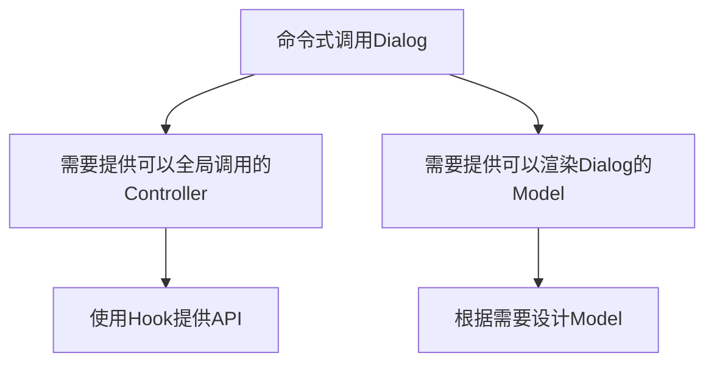

# 基于MUI实现的全局Dialog

# 概述

在最近使用MUI的过程中，我突然发现MUI的Dialog好像没有如同Arco Design那样自带[命令式调用方法](https://arco.design/react/components/modal#modalmethodconfig)，这个缺失的特性导致我在使用Dialog时（即便我只是想很简单地显示一点提示信息），必须显式地在UI中声明一个Dialog组件。

编写重复代码的过程其实是非常痛苦的，而当重复的代码慢慢累积起来之后，核心代码的可读性也会受到一定的影响。

为了减少编写重复代码的时间，我想使用”池化“的思维来构建一个全局的临时Dialog组，同时提供一个可以在全局进行调用的Hook，把展示临时Dialog的声明缩略到一条语句以内。

# 外部依赖

- React

- MUI

- Recoil（可选，不想用状态管理库的话，本文也提供了一种通过手写Observable同步全局状态的办法）

# 仓库

有人可能更喜欢从源码入手去理解逻辑，这里先把Demo的仓库丢出来：

[GitHub - sheason2019/global-dialog-demo](https://github.com/sheason2019/global-dialog-demo)

# 起步

为了节省时间，一些比较基础的部分我就不讲的太细了。

在开始正式编码之前，我们首先需要使用[Vite](https://cn.vitejs.dev/guide/)搭建起一个基础的React-Typescript框架，然后将React、[MUI](https://mui.com/zh/material-ui/getting-started/installation/)和[Recoil](https://recoiljs.org/zh-hans/)这三个依赖库添加至项目。

方便起见，这里把除了React以外的安装页面链接都附在了上面的超链接文本里。

# 分析需求

在上面的概述中，我提到了我希望在使用MUI时能像使用Arco Design一样通过命令式的方式调用Dialog，从而提升开发体验和代码结构。

根据这个核心的需要我们可以很快推导出我们需要做的事情：

可以看到，这是一个很典型的MVC设计，下面我们就按最常规的MVC开发流程来完成这个需求吧。

# Model层

